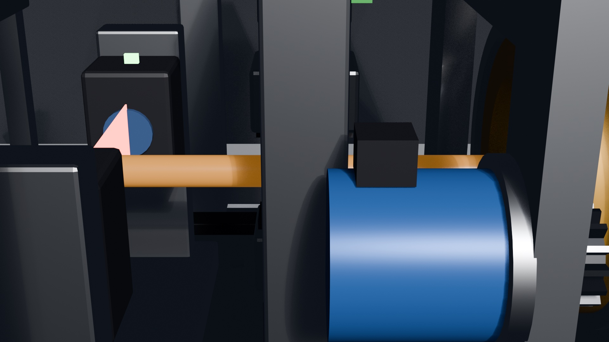
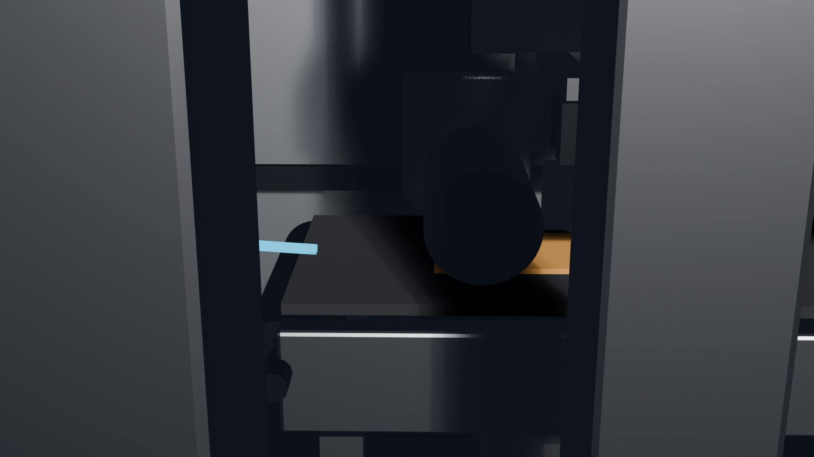

# Automated Cable Specimen Preparation System (ACSPS)

[](https://www.sih.gov.in/)
[](https://www.bis.gov.in/)
[-red?style=for-the-badge)]()
[-green?style=for-the-badge)]()
[](https://doi.org/10.64643/IJIRTV12I11-196451-459)

> **Electromechanical Automation of Cable Specimen Preparation for Quality Compliance Testing**  
> *Developed for the Ministry of Consumer Affairs, Government of India / National Test House (Smart India Hackathon 2025 — Hardware Category, Problem Statement ID: 26030).*

---

## 📌 Executive Overview

Manual preparation of electrical power cable specimens for Bureau of Indian Standards (BIS) conformity testing under **IS 10810** and **IS 7098** is historically labor-intensive, hazardous, and characterized by high operator-dependent geometric variability. Manual cutting, sheath stripping, slab pressing, and dumbbell punching require 8–12 minutes per specimen, introducing gauge-length variations of 1–3 mm and generating %GR&R errors of 73–81% that compromise the legal validity of type-test certifications.

The **Automated Cable Specimen Preparation System (ACSPS)** replaces the entire fragmented manual workflow with a single, unified, deterministic electromechanical machine:

$$\text{RAW CABLE} \longrightarrow \text{STRAIGHTEN} \longrightarrow \text{MEASURE} \longrightarrow \text{CLAMP} \longrightarrow \text{CUT / STRIP} \longrightarrow \text{FLATTEN / SLIT} \longrightarrow \text{DUMBBELL STAMP} \longrightarrow \text{EJECT}$$



---

## 🏆 Key Performance Benchmarks

Validated across 120 trials using standard 16 mm² four-core aluminium cable (conforming to IS 7098 Part 1) measured with a calibrated Mitutoyo 293-340-30 digital micrometer:

| Metric | Manual Baseline | ACSPS Automated | Improvement |
| :--- | :--- | :--- | :--- |
| **Cycle Time** | 480 – 720 s (avg. 600 s) | **142 ± 4 s** | **76% reduction** (4.2× throughput) |
| **Specimen Throughput** | 5 – 6 specimens/hour | **~25 specimens/hour** | **400%+ increase** |
| **Gauge-Length Repeatability ($\sigma$)** | 1.0 – 3.0 mm | **0.08 mm** | **>92% precision enhancement** |
| **Process Capability ($C_{pk}$)** | < 1.00 (Incapable) | **1.71** | **Surpasses Six Sigma ($C_{pk} \ge 1.67$)** |
| **Measurement Uncertainty (%GR&R)** | 73% – 81% | **~57%** | **Uncertainty reduced by ~78%** |
| **Safety Incidents** | Cutting hazard exposure | **0 incidents** | **IEC 62061 Cat 3 Compliant ($12\pm3$ ms E-STOP)** |

---

## 🛠️ System Architecture



### 1. Cascaded 4-Stage Mechanical Pipeline

The machine executes a sequential linear pipeline housed in a 900 × 300 × 280 mm chassis enclosed by a transparent, 5-Joule impact-resistant polycarbonate acrylic safety canopy:

```
┌─────────────────────────────────────────────────────────────────────────────────────────────┐
│                                 ACSPS SEQUENTIAL PIPELINE                                   │
└─────────────────────────────────────────────────────────────────────────────────────────────┘
  Stage 1: Cable Ingestion & Straightening
    │  • 4x rubber-coated roller pairs (Ø 80 mm, Shore 60–70A) prevent surface jacket yield.
    │  • NEMA 17 stepper motor with Module 1.5 spur gear train (2:1 reduction ratio).
    │  • Axial guide rails remove curvature induced by packaging reel memory.
    ▼
  Stage 2: Circumferential Cutting & Sheath Stripping
    │  • Dual 24V DC solenoid actuators (40 mm stroke) driving C-profile tool steel blades.
    │  • Scores through PVC/XLPE outer sheath without conductor core contact.
    │  • Reverse roller rotation pulls and strips the severed insulation sleeve cleanly.
    ▼
  Stage 3: Slab Flattening & Longitudinal Slitting
    │  • Stripped sleeve transfers onto an anodized aluminum block (100 × 80 × 15 mm).
    │  • NEMA 23 stepper transverses a calibrated weighted roller to release hoop stress.
    │  • Spring-loaded vertical blade performs longitudinal cut (|t_max - t_min| ≤ 0.10 mm).
    ▼
  Stage 4: Precision Dumbbell Die Stamping
       • High-force linear actuator (12V DC, 50 mm stroke) punches standard geometries.
       • Houses dual hardened-steel dies: IS 10810 Part 7 Type 1 (25 mm) & Type 2 (10 mm).
       • Quasi-static punching eliminates edge fraying, tears, and micro-delamination.
```


---

## ⚡ Electronics & Control System

The control system adopts a deterministic **hierarchical master-slave dual-microcontroller architecture** communicating via an I²C bus at 400 kHz:

* **Master Controller (Arduino Mega 2560):** Governs the high-level Finite State Machine (FSM), HMI screen coordination, inter-stage handshakes, and emergency-stop arbitration.
* **Slave Controller (Arduino Uno R3):** Dedicated to deterministic microstepping pulse generation (A4988 drivers, 1/8 microstepping at 0.225°/step) with trapezoidal acceleration profiles and discrete actuator timing.
* **Operator Interface (Nextion NX8048T050):** 5.1-inch capacitive touchscreen providing real-time process monitoring, live state visualization (≥5 Hz refresh), and diagnostic actuator overrides.

```
                              ┌───────────────────────┐
                              │  Nextion 5.1" HMI     │
                              └───────────┬───────────┘
                                          │ UART (Serial)
                                          ▼
┌──────────────────┐  Relay  ┌─────────────────────────┐   I²C (400 kHz)   ┌────────────────────────┐
│  Hardware E-STOP ├────────►│  Master: Arduino Mega   ├──────────────────►│  Slave: Arduino Uno    │
└──────────────────┘         └────────────┬────────────┘                   └───────────┬────────────┘
                                          │                                            │
                                          ▼                                            ▼
                             Solenoids & Safety Interlocks                   A4988 Drivers / Steppers
```

### Finite State Machine (FSM)

| State | Label | Active Actuators | Measured Duration |
| :---: | :--- | :--- | :---: |
| **S0** | `IDLE` | Standby awaiting HMI `START` signal | — |
| **S1** | `FEED_IN` | Ingestion rollers forward (200 mm feed @ 18 mm/s) | 18 s |
| **S2** | `CUT` | Dual circumferential cutting solenoids engage | 4 s |
| **S3** | `DECLAMP` | Solenoids retract + reverse roller indexing | 6 s |
| **S4** | `STRIP` | Secondary roller pair forward pull | 12 s |
| **S5** | `FLATTEN` | NEMA 23 weighted roller transverse pass | 45 s |
| **S6** | `SLIT` | Spring-loaded vertical blade linear traversal | 8 s |
| **S7** | `PUNCH` | Linear actuator drives Type 1 & Type 2 die plate | 12 s |
| **—** | *Transitions* | I²C register polling, relay debounce, settling time | ~37 s |
| **Total**| **Full Cycle** | **Complete conformant specimen output** | **142 ± 4 s** |

---

## 🛡️ Safety Architecture (IEC 62061 Category 3)

1. **Hardware-Isolated Emergency Stop:** The E-STOP circuit operates independently of software. Depression of the red mushroom latching switch opens a dedicated normally-closed relay in the primary motor power rail, collapsing actuator power in **$12 \pm 3\text{ ms}$** (exceeding the IEC 62061 standard of $\le 100\text{ ms}$).
2. **Mechanical Containment:** Enclosed transparent 3 mm polycarbonate canopy protects operators from all nip points, flying swarf, and blade strokes while maintaining full visual inspection.
3. **Software Watchdog & Interlocks:** Continuous limit-switch polling halts cycle execution if unexpected axis stall or canopy breach occurs.

---

## 📐 Standards & Regulatory Conformance

The system produces test specimens compliant with the following Indian Standards and international equivalents:

* **IS 10810 (Part 2):** Kelvin 4-terminal DC conductor resistance specimen preparation.
* **IS 10810 (Part 7):** Dumbbell specimen geometry for tensile strength and elongation-at-break testing (Type 1: 25 mm gauge length; Type 2: 10 mm gauge length).
* **IS 10810 (Part 33):** Flame-retardance test specimen preparation.
* **IS 7098 (Parts 1 & 2):** Cross-linked polyethylene (XLPE) insulated and PVC jacketed power cables.
* **ISO/IEC 17025 Readiness:** Direct traceability, elimination of human operator variance, and automated batch logging for accredited certification laboratories.

---

## 📂 Repository Contents

```
├── .gitignore                                     # Git ignore configuration (large frame cache, blend1 backups)
├── README.md                                      # Comprehensive project documentation
├── ACSPS_prototype.blend                          # Complete 3D CAD mechanical model & kinematic simulation (Blender)
├── prototype_execution.md                         # Quick reference execution steps & validation summaries
├── ACSPS_Hardware_First_Technical_Specifications.md # Detailed engineering & sensor/actuator specifications
├── ACSPS_Hardware_First_Implementation_Plan.md    # Hardware manufacturing & phased rollout strategy
├── wire specimen rp.md                            # Complete published peer-reviewed research manuscript
├── Video/
│   └── 0001-0700.mp4                              # Rendered 700-frame 3D kinematic simulation animation (9.2 MB)
└── assets/                                        # High-resolution render previews for documentation
    ├── prototype_cad_view.jpg
    ├── prototype_mechanism.jpg
    └── prototype_punch_station.jpg
```

---

## 🎬 3D Simulation & CAD Model

* **CAD Model (`ACSPS_prototype.blend`):** Contains the complete parametric assembly including the chassis, spur gear drivetrain, bearing mounts (KFL08), solenoid cutter mounts, roller sets, and dumbbell stamping die. Open using [Blender 3.0+](https://www.blender.org/).
* **Kinematic Simulation Video (`Video/0001-0700.mp4`):** Demonstrates the sequential motion of all 4 stages, from initial cable ingestion to final dumbbell specimen stamping.

---

## 📖 Academic Publication & Citation

If you use this work, design methodology, or dataset in your academic research or industrial implementation, please cite the original research paper:

```bibtex
@article{kataleri2025acsps,
  title     = {Electromechanical Automation of Cable Specimen Preparation for Compliance Testing: System Design, Validation, And Performance Analysis Under IS 10810 And IS 7098},
  author    = {Kataleri, Shabbir and Patil, Sahil and Thite, Gauri and Mane, Deven and Khandelwal, Raghav and More, Riya and Kulkarni, Sandeep},
  journal   = {International Journal of Innovative Research in Technology (IJIRT)},
  volume    = {12},
  number    = {11},
  pages     = {196451--459},
  year      = {2025},
  doi       = {10.64643/IJIRTV12I11-196451-459},
  note      = {First Prize Winner, Smart India Hackathon (SIH) 2025, Hardware Category, Ministry of Consumer Affairs / National Test House}
}
```

---

## 👥 Authors & Team

* **Shabbir Kataleri** — School of Engineering, Ajeenkya DY Patil University, Pune
* **Sahil Patil** — School of Engineering, Ajeenkya DY Patil University, Pune
* **Gauri Thite** — School of Engineering, Ajeenkya DY Patil University, Pune
* **Deven Mane** — School of Engineering, Ajeenkya DY Patil University, Pune
* **Raghav Khandelwal** — School of Engineering, Ajeenkya DY Patil University, Pune
* **Riya More** — School of Engineering, Ajeenkya DY Patil University, Pune
* **Dr. Sandeep Kulkarni** (Faculty Mentor) — Assistant Professor, School of Engineering, Ajeenkya DY Patil University, Pune

---

## 📄 License

This project is licensed under the [MIT License](LICENSE).
